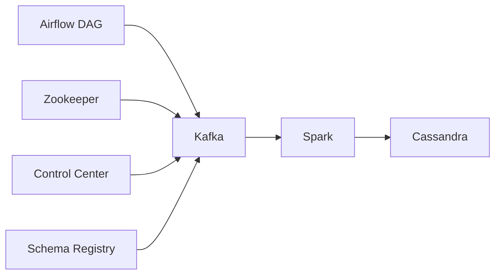

# Data Engineering Pipeline with Airflow, Kafka, and Spark

A comprehensive data engineering project demonstrating end-to-end data pipeline implementation using modern data processing technologies.

## Project Overview

This project implements a real-time data pipeline that:
1. Fetches data from external APIs
2. Processes it through a streaming pipeline
3. Stores it in a distributed database

## Architecture



### Components

1. **Data Ingestion (Airflow)**
   - Fetches data from randomuser.me API
   - Orchestrates the data pipeline
   - Manages scheduling and dependencies

2. **Stream Processing (Kafka)**
   - Handles real-time data streaming
   - Managed by Zookeeper
   - Includes:
     - Control Center for monitoring
     - Schema Registry for data validation

3. **Data Processing (Spark)**
   - Distributed processing engine
   - Master-Worker architecture
   - Processes streaming data from Kafka

4. **Data Storage (Cassandra)**
   - Distributed NoSQL database
   - Stores processed data
   - Provides high availability and scalability

## Infrastructure

The entire stack is containerized using Docker Compose, which manages:
- Apache Airflow
- Apache Kafka
- Apache Zookeeper
- Confluent Control Center
- Schema Registry
- Apache Spark
- Apache Cassandra

## Getting Started

1. Clone the repository
2. Follow the installation guide in `docs/installation_guide.md`
3. Set up the environment using the provided Docker Compose configuration
4. Initialize the services
5. Monitor the pipeline through Airflow UI

## Documentation

Detailed documentation is available in the `docs` directory:
- Installation guide
- Architecture details
- Troubleshooting steps
- Best practices

## Development

To contribute to this project:
1. Create a new branch
2. Make your changes
3. Submit a pull request

## Quick Commands

```bash
# Initialize git repository
git add .
git commit -m 'First Commit'
git push origin main
```

## License

[Add your license information here]

## Contact

[Add contact information here]


